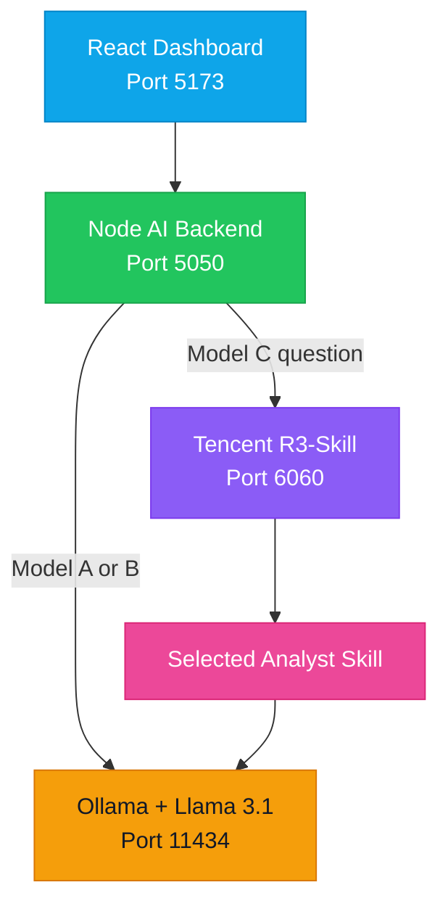

<div align="center">

# 🌍 Global Situation Dashboard

### Local Edge AI: Deterministic vs Probabilistic vs Tencent R3-Skill


An extension of the open-source Global Situation Dashboard that compares three locally operated AI approaches using live-style global intelligence data.

[Overview](#-project-overview) •
[Models](#-model-comparison) •
[Architecture](#-local-architecture) •
[Installation](#-installation) •
[Testing](#-model-testing) •
[Reflection](#-ice-task-4--evaluation-and-reflection) •
[Video](#-assessment-video) •
[Submission](#-submission)

</div>

---

## 👨‍🎓 Student Information

| Field | Details |
|:--|:--|
| **Student** | Nikhil Saroop |
| **Student number** | ST10040092 |
| **Programme** | Postgraduate Diploma in Data Analytics |
| **Module** | PDAN8412 — Programming for Data Analytics 2 |
| **Assessment** | ICE Tasks 3 and 4 — Edge AI implementation, testing and reflection |
| **Original project** | [The-ProfessorGG/global-situation-dashboard](https://github.com/The-ProfessorGG/global-situation-dashboard) |
| **Student fork** | [NikhilSAROOP-21/global-situation-dashboard](https://github.com/NikhilSAROOP-21/global-situation-dashboard) |

---

## 📌 Project Overview

The dashboard presents a local interactive view of multiple intelligence domains:

| Domain | Examples |
|:--|:--|
| 🌐 **Global risk** | Risk level, risk score and prioritised threats |
| 🛡️ **Cybersecurity** | CVEs, CVSS scores, KEVs, ransomware and data breaches |
| 🌋 **Disasters** | Earthquakes, volcanoes and severe events |
| ✈️ **Aviation** | Aircraft locations, speed, altitude and callsigns |
| 🚢 **Maritime** | Vessel activity, ports, cargo ships and tankers |
| 🛰️ **Space** | ISS activity, satellites and space weather |
| 📡 **Networks** | Internet outages, BGP anomalies and connectivity risks |

### Project Extension

- Added three selectable local AI modes to the React interface.
- Connected the dashboard to a local Node.js AI backend.
- Used Ollama and Llama 3.1 for local language generation.
- Added a local Tencent R3-Skill routing service.
- Removed large Three.js rendering objects before sending dashboard data to the model.
- Displayed model parameters and R3 routing evidence in the interface.
- Kept all AI processing on the local computer with no cloud AI calls.

---

## 🧠 Model Comparison

| Model | Type | Local technology | Key configuration | Expected behaviour |
|:--|:--|:--|:--|:--|
|  | Deterministic generation | Ollama + Llama 3.1 | `temperature: 0`<br>`top_k: 1`<br>`top_p: 1`<br>`seed: 42` | Same question and unchanged snapshot should produce the same response |
|  | Sampled generation | Ollama + Llama 3.1 | `temperature: 0.8`<br>`top_k: 40`<br>`top_p: 0.9`<br>random seed | Repeated runs can produce different wording |
|  | Specialist-skill routing | Tencent R3-Skill + Ollama + Llama 3.1 | embedding retrieval<br>reranking<br>deterministic generation | Selects the most relevant analyst skill before producing an answer |

### 🔵 Model A — Deterministic

- Uses the local `llama3.1` model through Ollama.
- Uses temperature `0` and a fixed seed of `42`.
- Supports repeatable analyst-style output.
- Provides a controlled comparison against the probabilistic model.

### 🟠 Model B — Probabilistic

- Uses the same local `llama3.1` model.
- Enables sampling with temperature `0.8`.
- Generates a different random seed for each request.
- Can vary its wording even when the user repeats the same question.

### 🟣 Model C — Tencent R3-Skill

- Runs Tencent R3-Skill locally as a specialist router.
- Uses an embedding model to retrieve relevant analyst skills.
- Uses a reranker to select the best specialist.
- Sends the selected specialist guidance to the local Llama 3.1 model.
- Displays the selected skill, routing score and processing device.
- Was verified locally using CUDA device `cuda:0`.

> [!IMPORTANT]
> Model C does not produce the final wording by itself. Tencent R3-Skill selects the most relevant analyst role, and the local Llama 3.1 model then generates the dashboard-based response.

### Required Model Distinction Note

> Model A is deterministic because it uses temperature 0, greedy-style selection and a fixed seed, so an unchanged input should produce the same output. Model B is probabilistic because it uses temperature 0.8, sampling parameters and a changing random seed, allowing repeated runs to differ. Model C uses Tencent R3-Skill locally to select the most relevant analyst skill before the local Llama 3.1 model generates the response.

---

## 🎯 Model C Analyst Skills

| # | Analyst skill | Focus area |
|--:|:--|:--|
| 1 | 🌐 **Global Risk Analyst** | Risk level, risk score, top threat and contributing events |
| 2 | 🛡️ **Cyber Threat Analyst** | CVEs, CVSS, KEVs, ransomware and breaches |
| 3 | 🌋 **Disaster Analyst** | Earthquakes, volcanoes and severe environmental events |
| 4 | ✈️ **Aviation Analyst** | Aircraft activity, callsigns, altitude and speed |
| 5 | 🚢 **Maritime Analyst** | Vessel movements, ports, cargo ships and tankers |
| 6 | 🛰️ **Space Operations Analyst** | ISS, satellites, orbital data and space weather |
| 7 | 📡 **Network Intelligence Analyst** | Internet outages, BGP anomalies and routing risks |
| 8 | 🔗 **Threat Correlation Analyst** | Related events, confidence scores and cascading risks |
| 9 | ❤️ **Feed Health Analyst** | Feed availability, stale information and reliability |

---

## 🏗️ Local Architecture



### Local Services

| Service | Port | Purpose | Health/status |
|:--|--:|:--|:--|
|  | `5173` | Dashboard interface | `http://localhost:5173` |
|  | `5050` | Cleans data and coordinates models | `http://localhost:5050/api/health` |
|  | `11434` | Local language-model inference | `http://127.0.0.1:11434` |
|  | `6060` | Specialist-skill routing | `http://127.0.0.1:6060/api/health` |

---

## 📁 Repository Structure

```text
global-situation-dashboard
├── public
├── server
│   └── index.js
├── src
│   ├── assets
│   ├── App.css
│   ├── App.jsx
│   ├── index.css
│   └── main.jsx
├── model-c-r3
│   ├── .venv                  # Local only; excluded from Git
│   └── R3-Skill
│       ├── data
│       ├── models             # Local weights; excluded from Git
│       ├── dashboard_skills.jsonl
│       ├── infer.py
│       ├── r3_service.py
│       ├── requirements.txt
│       └── README.md
├── .gitignore
├── package.json
├── package-lock.json
├── README.md
└── vite.config.js
```

---

## ✅ Requirements

| Requirement | Recommended version | Check command |
|:--|:--|:--|
| Git | Current stable version | `git --version` |
| Node.js | 20 or later | `node --version` |
| npm | Compatible with Node.js | `npm --version` |
| Ollama | Current stable version | `ollama --version` |
| Llama | `llama3.1` | `ollama list` |
| Python | 3.13 | `python --version` |
| CUDA | Optional, recommended for R3 | Check in R3 health response |

---

## 🚀 Installation

### 1. Clone the Student Fork

```powershell
git clone https://github.com/NikhilSAROOP-21/global-situation-dashboard.git
cd global-situation-dashboard
```

### 2. Install the Node Dependencies

```powershell
npm install
```

### 3. Install the Local Llama Model

```powershell
ollama pull llama3.1
ollama list
```

### 4. Create the Model C Environment

```powershell
py -3.13 -m venv .\model-c-r3\.venv
Set-ExecutionPolicy -Scope Process -ExecutionPolicy RemoteSigned
.\model-c-r3\.venv\Scripts\Activate.ps1
python -m pip install --upgrade pip
python -m pip install -r .\model-c-r3\R3-Skill\requirements.txt
```

### 5. Prepare Tencent R3-Skill

- Follow the included `model-c-r3/R3-Skill/README.md` instructions.
- Store embedding weights in `model-c-r3/R3-Skill/models/r3-embedding`.
- Store reranker weights in `model-c-r3/R3-Skill/models/r3-reranker`.
- Keep the large model weights and virtual environment out of Git.

---

## ▶️ Running the Complete Project

Keep all four services running in separate VS Code terminals.

| Terminal | Service | Command | Successful result |
|--:|:--|:--|:--|
| **1** | Ollama | `ollama serve` | Listening on port `11434` |
| **2** | Tencent R3-Skill | `& ".\model-c-r3\.venv\Scripts\python.exe" ".\model-c-r3\R3-Skill\r3_service.py"` | Model C running on port `6060` |
| **3** | Node backend | `node .\server\index.js` | AI assistant running on port `5050` |
| **4** | Vite dashboard | `npm run dev` | Dashboard available on port `5173` |

### Service Checks

| Check | Address | Expected result |
|:--|:--|:--|
| Dashboard | `http://localhost:5173` | Interactive globe and event panels |
| Node backend | `http://localhost:5050/api/health` | JSON listing `deterministic`, `probabilistic` and `r3` |
| R3 service | `http://127.0.0.1:6060/api/health` | JSON with status, skill count and device |

> [!NOTE]
> `Cannot GET /` at `http://localhost:5050/` is expected. The Node backend exposes API routes rather than a web home page, so use `/api/health`.

---

## 🔌 API Routes

| Service | Method | Route | Purpose |
|:--|:--:|:--|:--|
| Node | `GET` | `/api/health` | Confirms the backend and lists model modes |
| Node | `POST` | `/api/assistant` | Runs Model A, Model B or Model C |
| R3 | `GET` | `/api/health` | Confirms R3 models, skills and device |
| R3 | `POST` | `/api/route` | Selects and ranks analyst skills |

---

## 🧪 Model Testing

### Evidence Checklist

| Test | Question | Evidence to confirm |
|:--|:--|:--|
| 🔵 **Model A** | `Give a two-sentence summary of the current global risk level.` | Temperature `0`, seed `42` and matching repeated output |
| 🟠 **Model B** | Use the same Model A question twice | Temperature `0.8`, changing seeds and varied wording |
| 🟣 **Model C — Risk** | `What is causing the current global risk level?` | Selected skill: `Global Risk Analyst` |
| 🟣 **Model C — Cyber** | `Which critical CVE requires urgent investigation?` | Selected skill: `Cyber Threat Analyst` |
| 🟣 **Model C — Disaster** | `Summarise the most significant earthquakes and volcanoes currently shown.` | Selected skill: `Disaster Analyst` |

### Verified Model C Evidence

| Verification | Result |
|:--|:--|
| R3 router | Tencent R3-Skill |
| Global-risk routing | `Global Risk Analyst` selected |
| Cyber routing | `Cyber Threat Analyst` selected |
| Local answer model | `llama3.1` |
| R3 processing device | `cuda:0` |
| Cloud AI dependency | None |

> [!TIP]
> The dashboard feeds can change between requests. Test deterministic behaviour using the same question and an unchanged dashboard snapshot.

---

## 🎥 ICE Task 4 — Evaluation and Reflection

### Testing Approach

- The same six standard questions are asked of Model A and Model B.
- Every question is run at least twice per model to investigate consistency.
- The dashboard is not refreshed between comparable runs because its live-style data can change.
- Model A and Model B use the same local Llama 3.1 model and dashboard snapshot.
- Only their generation settings are changed, allowing a fair comparison of deterministic and probabilistic behaviour.

### 🧩 Challenges on Local and Limited Hardware

- Ollama, the Node.js backend and the Vite dashboard must run simultaneously in separate terminals.
- The local Llama 3.1 model is several gigabytes in size, so its first response can take longer while the model is loaded into memory.
- Local inference uses substantial RAM, GPU memory and processing power compared with calling a hosted AI service.
- The dashboard originally supplied large Three.js rendering objects that were not useful for the analysis.
- These objects caused the model to focus on JSON and rendering information instead of the intelligence question.
- A cleaning function was therefore added to remove geometry, materials, matrices and private rendering properties before inference.
- Testing also required care because changing live dashboard data can make two otherwise identical model requests receive different inputs.

### 💡 New Learning

- Deterministic and probabilistic behaviour can be produced using the same language model by changing its decoding parameters.
- Temperature, top-k, top-p and the random seed directly influence repeatability and variation.
- A deterministic result still requires the complete input snapshot to remain unchanged.
- A local React interface can communicate with a Node.js backend and an Ollama model without using a cloud AI API.
- Raw application state should be filtered before it is sent to a model so that only relevant information is included.
- Tencent R3-Skill can route a question to a specialist analyst role before a local language model produces the final answer.

### 🔧 Suggested Improvements

- Save one timestamped dashboard snapshot and reuse it for every model comparison.
- Add an automated test runner that submits all six standard questions twice and stores the responses.
- Record response time, selected model settings, input timestamp and output for every test.
- Display source timestamps and feed-health information beside every AI answer.
- Add evidence links so that users can inspect the events supporting each conclusion.
- Use calibrated confidence indicators based on feed completeness and source quality instead of relying only on the language model's self-reported confidence.
- Consider a smaller or quantised local model when the dashboard must run on hardware with less memory.

### ⚖️ Model Comparison

| Comparison area | Model A — Deterministic | Model B — Probabilistic |
|:--|:--|:--|
| Configuration | Temperature `0` and fixed seed `42` | Temperature `0.8` and changing random seed |
| Repeated responses | Designed to preserve the same conclusion for an unchanged snapshot | Can change wording, emphasis or recommendations |
| Main strength | Consistent, repeatable and easier to audit | More varied language and exploratory suggestions |
| Main limitation | Can sound rigid and repeat an unhelpful answer | Variation may reduce reliability in operational reporting |
| Dashboard suitability | Better suited to official risk summaries and repeatable alerts | Better suited to exploratory analysis and alternative viewpoints |

Model A felt more useful for a live operational risk dashboard because consistency and traceability are important when users rely on a risk summary. Model B was useful for generating alternative wording and perspectives, but changing responses may create uncertainty when the underlying evidence has not changed.

### 🔄 Live Updating or a Fixed Model?

- The incoming dashboard feeds should continue updating so that the model receives current event information.
- The model should not automatically retrain itself from every incoming event.
- Model weights, prompts and generation settings should remain versioned and controlled during normal operation.
- Updates should be tested offline and approved before a new model version is used.
- Continuous unsupervised learning could introduce data poisoning, misinformation, bias, model drift and unpredictable behaviour.
- A completely static system could become outdated as terminology, threats and event patterns change.
- A controlled approach is therefore preferable: live data with a fixed deployed model, followed by periodic reviewed updates.

### 😮 Most Surprising Finding

The most surprising finding was that the same local Llama 3.1 model could behave differently simply by changing temperature, sampling and seed settings. It was also surprising that the complete dashboard-aware AI workflow, including Tencent R3-Skill routing, could operate locally without sending dashboard data to a cloud AI service.

### 📺 Assessment Video

The assessment video demonstrates both models answering the standard question set, explains the relevant code and reflects on the implementation experience.

[](https://youtu.be/hj9UBzVu9j4)

> [!IMPORTANT]
> Replace `REPLACE_WITH_VIDEO_ID` with the real YouTube video ID after uploading the final video. The submitted video must be no longer than five minutes.

---

## 🔒 Privacy and Local Processing

| Control | Implementation |
|:--|:--|
| **Local inference** | Ollama and Tencent R3-Skill run on the same computer |
| **No cloud AI** | No external AI API is used |
| **Input reduction** | Large rendering data is removed before inference |
| **Blocked properties** | Geometry, materials, matrices and private rendering keys |
| **Bounded data** | Large arrays and strings are limited before model processing |

---

## 🛠️ Troubleshooting

<details>
<summary><strong>The dashboard does not load</strong></summary>

```powershell
npm run dev
```

Open `http://localhost:5173`.

</details>

<details>
<summary><strong>The dashboard cannot connect to the AI assistant</strong></summary>

```powershell
node .\server\index.js
```

Confirm that `http://localhost:5050/api/health` returns JSON.

</details>

<details>
<summary><strong>Model C is unavailable</strong></summary>

```powershell
& ".\model-c-r3\.venv\Scripts\python.exe" ".\model-c-r3\R3-Skill\r3_service.py"
```

Confirm that `http://127.0.0.1:6060/api/health` returns JSON.

</details>

<details>
<summary><strong>Ollama does not respond</strong></summary>

```powershell
ollama serve
ollama list
```

Confirm that `llama3.1:latest` appears in the model list.

</details>

<details>
<summary><strong>The backend displays Cannot GET /</strong></summary>

Use the correct health endpoint:

```text
http://localhost:5050/api/health
```

</details>

---

## 📋 Final Validation

### Build Check

```powershell
npm run build
```

### Git Check

```powershell
git status
```

### Commit and Push

```powershell
git add .
git commit -m "Complete ICE Tasks 3 and 4"
git push origin master
```

> [!WARNING]
> Do not commit `node_modules`, Python virtual environments, model weights, secrets or large downloaded files.

---

## 🙏 Attribution

| Component | Attribution |
|:--|:--|
| Original dashboard | [The-ProfessorGG/global-situation-dashboard](https://github.com/The-ProfessorGG/global-situation-dashboard) |
| Student extension | Three-mode local AI interface, Node orchestration and input cleaning |
| Local generation | Ollama with Llama 3.1 |
| Skill routing | Tencent R3-Skill, subject to its original licence |
| Original dashboard licence | MIT License |

---

## 📤 Submission

<div align="center">

### GitHub Repository

[](https://github.com/NikhilSAROOP-21/global-situation-dashboard)

**Submission link:**  
[https://github.com/NikhilSAROOP-21/global-situation-dashboard](https://github.com/NikhilSAROOP-21/global-situation-dashboard)

### YouTube Video

[](https://youtu.be/REPLACE_WITH_VIDEO_ID)

**Video link:**  
[https://youtu.be/REPLACE_WITH_VIDEO_ID](https://youtu.be/REPLACE_WITH_VIDEO_ID)

---

Prepared for **PDAN8412 — Programming for Data Analytics 2**.

</div>
